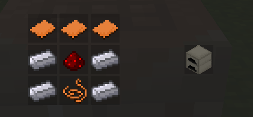

## Гайд: интеграция мода с Voxelcraft

### 1. Создаём контент-пак

Создадим папку example-mod со следующим содержимым: 

```
<название вашего мода>/
├── modules/
├── scripts/
├── package.json
```

Начнём с заполнения `package.json`. Я крайне рекомендую включить `voxelcraft` в зависимости пакета:

```json
{
    "id": <id вашего мода>,
    "title": <название вашего мода>,
    "version": <версия вашего мода>,
    "creator": <ваши инициалы (или любая другая подпись)>,
    "description": <описание вашего мода>,
    "dependencies": [
        "voxelcraft"
    ]
}
```

### 2. Пишем код

В этом примере мы создадим простой крафт. Я добавил несколько блоков и предметов для наглядности, однако они спокойно могут быть заменены на блоки и предметы из вашего мода. Создадим файл `main.lua` в папке `modules` и импортируем API voxelcraft-а:

```lua
require "voxelcraft:core"
```

Теперь воспользуемся функцией `add_crafting_table_craft` для создания крафта:

```lua
voxelcraft_core.craft.crafting.add_crafting_table_craft({
    "examplemod:copper_plate", "examplemod:copper_plate", "examplemod:copper_plate", 
    "examplemod:lead", "examplemod:redstone", "examplemod:lead", 
    "examplemod:lead", "examplemod:copper_wire", "examplemod:lead", 
}, {"examplemod:electric_furnace.item", 1}, "voxelcraft:crafting_table")
```

Таблица передаваемая в первом аргументе - предметы которые необходимо расположить на сетке крафта, чтобы получить предмет из второго аргумента.

> ![IMPORTANT]
> В таблице указываются ПРЕДМЕТЫ. Т. е. если в крафте используется блок, то нужно дописать .item в конце.

Получившийся крафт в игре выглядит так:



Осталось только импортировать этот файл из файла `scripts/world.lua`:

```lua
require "<id вашего мода>:main"
```

Полное описание API можно посмотреть в документации. Примеры кода можно увидеть в исходниках voxelcraft.

## Портирование уже готового мода

Портирование мода не сильно отличается от перового раздела. Портировать мод можно двумя способами:

1. Можно вносить изменения прямо в исходники вашего мода. Я крайне не рекомендую этот подход, если вы хотите оставить возможность запуска без voxelcraft. Однако это будет очень удобным если геймплей вашего мода неразрывно связан с механиками voxelcraft.

2. Второй способ создать мод-переходник между двумя модами. Иначе говоря, крафты и скрипты требующие API вы создаёте в моде-переходнике, а всё остальное - в основном моде.
